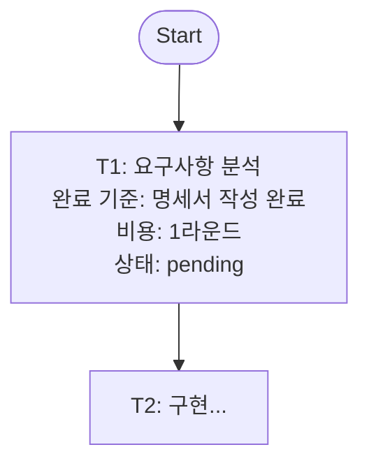

# 4개 OpenCowork 프로젝트 비교 분석
> 작성일: 2026-04-01 | 실제 코드 기반 분석

---

## 프로젝트 개요

| 항목 | openwork (LangChain) | open-claude-cowork (Composio) | OpenCowork (cowork-studio) | OpenCowork (AIDotNet) |
|------|---------------------|-------------------------------|---------------------------|----------------------|
| **스택** | TypeScript + Electron | JS + Electron + Express | Python + Flask | TypeScript + Electron |
| **에이전트 기반** | deepagentsjs SDK | Claude Agent SDK | 자체 구현 ReAct | 자체 AsyncGenerator |
| **LangGraph** | ✅ 사용 | ❌ | ❌ | ❌ |
| **멀티에이전트** | SubAgent (도구 기반) | ❌ 없음 | ✅ Manager + Executor | ✅ Lead + Teams |
| **시스템 프롬프트** | 상세 (few-shot 포함) | SDK 기본값 의존 | 자체 설계 (긴 프롬프트) | 동적 생성 (모드별) |
| **파일시스템** | LocalSandbox | Bash 도구 | 13개 코어 툴 | IPC 기반 파일 핸들러 |
| **상태 지속성** | SQLite 체크포인터 | localStorage | 파일 기반 (plan.md) | SQLite |
| **외부 연동** | ❌ | Composio 500+ SaaS | MCP 지원 | 메시징 9개 플랫폼 |
| **HITL** | ✅ 명시적 승인 UI | ❌ | talk_to_user 도구 | ✅ 승인 게이트 |
| **코드 규모** | ~11,585 줄 (TS) | 소규모 | ~40,000+ 줄 (Python) | 대규모 (TS 92.8%) |

---

## 1. openwork (LangChain 공식)

### 핵심 아키텍처
```
Electron Main Process
├── createAgentRuntime() → DeepAgent (deepagentsjs)
├── SqlJsSaver (체크포인터, 스레드별 SQLite)
├── LocalSandbox (파일시스템 + 셸 실행)
└── IPC 핸들러 (invoke / interrupt / resume)

Electron Renderer (React)
├── ElectronIPCTransport (IPC → AsyncGenerator 변환)
├── ThreadContext (스레드별 상태)
├── HITL 승인 UI (approve / reject / edit)
└── 칸반 뷰 (서브에이전트 시각화)
```

### 시스템 프롬프트 핵심
```
- 간결하게 답변 (4줄 이하)
- 파일 작업 후 설명 금지
- write_todos: 3단계 이상 복잡한 태스크에만 사용
- execute 도구: 항상 HITL 승인 필요
- 경로: 절대경로 사용 (workspacePath 주입)
```

### 핵심 특징
- **스레드별 완전 격리**: 체크포인터 DB를 스레드마다 별도 생성
- **중단-재개**: 체크포인트 기반 HITL (거절 → 대안 제시 → 재개)
- **ElectronIPCTransport**: IPC 콜백을 AsyncGenerator로 변환하는 독창적 설계

### 강점 / 약점
| 강점 | 약점 |
|------|------|
| DeepAgents SDK 공식 레퍼런스 | 도구 커스터마이징 불가 (하드코딩) |
| 체크포인트 기반 완벽한 상태 복구 | sql.js 메모리 한계 (~100MB) |
| 멀티스레드 안전 (동시성 보장) | IPC 이벤트 파싱 취약 (SDK 변경 시 깨짐) |

---

## 2. open-claude-cowork (Composio)

### 핵심 아키텍처
```
Electron → Express Backend (포트 3001) → Claude Agent SDK / Opencode SDK
                ↓
          Composio Tool Router (MCP HTTP)
                ↓
          500+ SaaS 연동 (Gmail, Slack, GitHub...)
```

### 프로바이더 추상화
```javascript
BaseProvider (인터페이스)
├── ClaudeProvider → Claude Agent SDK (세션 재개 지원)
└── OpencodeProvider → Opencode SDK
```

### 시스템 프롬프트
**없음** — SDK 기본값 완전 의존. SKILL.md만 사용:
```yaml
---
description: Use this skill when the user asks about [topic]
---
# Instructions...
```

### 핵심 특징
- **멀티프로바이더**: Claude / Opencode 런타임 전환 가능
- **SSE 스트리밍**: heartbeat 15초, 토큰 단위 실시간 출력
- **세션 재개**: `session_id` 저장 → 대화 연속성 보장

### 강점 / 약점
| 강점 | 약점 |
|------|------|
| Composio 500+ SaaS 즉시 연동 | 멀티에이전트 없음 |
| 깔끔한 프로바이더 추상화 | 시스템 프롬프트 커스터마이징 불가 |
| 세션 지속성 | HITL 없음, 안전장치 미흡 |

---

## 3. OpenCowork (cowork-studio) — 가장 Cowork에 가까운 구현

### 핵심 아키텍처
```
main.py (Task Manager)
└── MultiRoundTaskExecutor (최대 50라운드 반복)
    └── ToolExecutor (LLM 호출 + 도구 실행)
        └── 13개 코어 도구 레이어

멀티에이전트:
Manager Agent
├── spawn_agent("agent_001", task) → 백그라운드 스레드
├── spawn_agent("agent_002", task) → 백그라운드 스레드
└── 상태 파일로 동기화 (.agia_spawn_agent_XXX_status.json)
```

### 시스템 프롬프트 핵심 (실제 내용)
```
"I'm a passionate geek developer! I absolutely love coding..."

Plan-based ReAct:
- 1라운드: plan.md 생성 (Mermaid 플로우차트)
- 이후 라운드: plan.md 읽기 → 현재 태스크 실행 → 상태 업데이트

태스크 완료 신호: "TASK_COMPLETED: [설명]"
무한 대기: IDLE 도구 (sleep=-1)
```

### Plan.md 구조


### 에이전트 간 메시징
```
메시지 타입: STATUS_UPDATE / TASK_REQUEST / BROADCAST / ERROR
우선순위: LOW / NORMAL / HIGH / URGENT
메일박스: inbox / outbox / sent 디렉토리
5라운드마다 자동 상태 보고
```

### 도구 포맷 자동 감지
```python
# JSON 먼저 시도 → 실패 시 XML 파싱
calls = parse_tool_calls_from_json(response)
if not calls:
    calls = parse_tool_calls_from_xml(response)
```

### 강점 / 약점
| 강점 | 약점 |
|------|------|
| Plan-based ReAct → 가장 자율적 실행 | 복잡도 높음 (40K+ 줄) |
| 파일 기반 멀티에이전트 (단순하고 강력) | 파일 동기화 레이스 컨디션 위험 |
| 13개 코어 도구 완비 | 의존성 무거움 (Playwright, Pandoc 등) |
| 유니버설 모델 지원 (Claude/GPT/DeepSeek/Qwen) | HITL UI 미흡 |

---

## 4. OpenCowork (AIDotNet) — 가장 완성도 높은 플랫폼

### 핵심 아키텍처
```
Electron Main Process
├── IPC 핸들러 (Files, Shell, DB, Cron, SSH)
├── ChannelManager (메시징 플랫폼 팩토리)
├── MCP Manager (복수 서버 연결)
├── Cron 스케줄러 (백그라운드 태스크)
└── SQLite (대화, 태스크, 에이전트)

Renderer (React)
├── runAgentLoop() → AsyncGenerator (핵심 에이전트 루프)
├── runSubAgent() → 전문화 서브에이전트
├── ToolRegistry (동적 등록, 3계층)
└── Zustand (Chat / Agent / Channel / Team 스토어)
```

### 동적 시스템 프롬프트 (모드별)
```typescript
모드 4가지:
- clarify: 요구사항 수집 전략가 (직접 조사 후 질문)
- code:    페어프로그래밍 파트너 (최소 수정 원칙)
- cowork:  협업 에이전트 (코딩 + 리서치 + DevOps)
- acp:     아키텍처 리드 (직접 코드 작성 금지, 서브에이전트만 사용)

동적 주입:
- 실행 환경 (로컬 / SSH 원격)
- 메모리 레이어 (SOUL.md / USER.md / MEMORY.md / daily)
- 사용자 규칙 (override 가능)
- 활성 스킬 목록
```

### AsyncGenerator 에이전트 루프
```typescript
async function* runAgentLoop(messages, config, toolCtx, onApproval) {
  yield { type: 'loop_start' }
  while (!limitReached) {
    // 컨텍스트 압축 (필요 시)
    // 메시지 큐 드레인 (에이전트 간 통신)
    // LLM 스트리밍 호출
    yield { type: 'text_delta', text }
    yield { type: 'tool_use_generated', toolUseBlock }
    // 도구 실행 (승인 게이트 포함)
    // 결과를 대화에 추가
    yield { type: 'iteration_end' }
  }
  yield { type: 'loop_end' }
}
```

### 서브에이전트 도구 자동 승인
```typescript
const READ_ONLY_SET = new Set(['Read', 'LS', 'Glob', 'Grep', 'TaskList'])
// 읽기 전용 도구 → 자동 승인
// 쓰기 도구 → 부모 에이전트로 승인 버블업
```

### 메시징 플랫폼 연동 (9개)
Feishu / DingTalk / Discord / Telegram / WhatsApp / WeChat / WeCom / QQ / Weixin

### 강점 / 약점
| 강점 | 약점 |
|------|------|
| 가장 정교한 시스템 프롬프트 설계 | 복잡도 매우 높음 (학습 곡선) |
| AsyncGenerator 루프 → 완전한 스트리밍 제어 | 도구 승인 UX 개선 필요 |
| 9개 메시징 플랫폼 기업 연동 | 서브에이전트 오류 처리 미흡 |
| 4가지 모드 (ACP 모드가 Cowork 핵심) | 테스트 인프라 없음 |

---

## 핵심 비교: 프롬프트 설계 수준

| 프로젝트 | 프롬프트 수준 | 특이점 |
|----------|-------------|--------|
| openwork | ★★★☆☆ | 간결함 우선, few-shot 최소 |
| open-claude-cowork | ★☆☆☆☆ | SDK 기본값 의존 (프롬프트 없음) |
| cowork-studio | ★★★★☆ | Plan-based ReAct 독자 설계, 개성 있는 페르소나 |
| AIDotNet | ★★★★★ | 모드별 동적 생성, 메모리 레이어, 환경 컨텍스트 |

---

## 사내 시스템 구축 시 참고할 설계 패턴

### openwork에서 가져올 것
- SqlJsSaver 패턴 (스레드별 격리 체크포인터)
- ElectronIPCTransport (IPC→AsyncGenerator 변환)
- execute 도구 HITL 강제 패턴

### cowork-studio에서 가져올 것
- Plan.md 기반 태스크 관리 구조
- 5라운드마다 자동 상태 보고 규칙
- 도구 포맷 자동 감지 (JSON → XML 폴백)
- 13개 코어 도구 목록

### AIDotNet에서 가져올 것
- **모드별 시스템 프롬프트 동적 생성** (가장 중요)
- AsyncGenerator 에이전트 루프 구조
- 읽기 전용 도구 자동 승인 / 쓰기 도구 버블업 패턴
- 3계층 도구 레지스트리 (인라인 / 로컬 / 글로벌)
- SOUL.md / USER.md / MEMORY.md 메모리 레이어

### open-claude-cowork에서 가져올 것
- 멀티프로바이더 추상화 패턴
- Composio 연동 방식 (사내 SaaS 연동 참고)

---

## 결론: 사내 구축 방향 권고

```
DeepAgents SDK (기반)
+ AIDotNet 모드별 동적 프롬프트 설계
+ cowork-studio Plan.md ReAct 패턴
+ openwork 체크포인터 / HITL 구조
= 사내 Cowork 시스템
```

**가장 중요한 단일 요소**: AIDotNet의 `buildSystemPrompt()` 방식.
모드(clarify / code / cowork / acp) + 환경 + 메모리 + 사용자 규칙을
동적으로 조합하는 구조가 Cowork의 자율성을 만들어내는 핵심.
